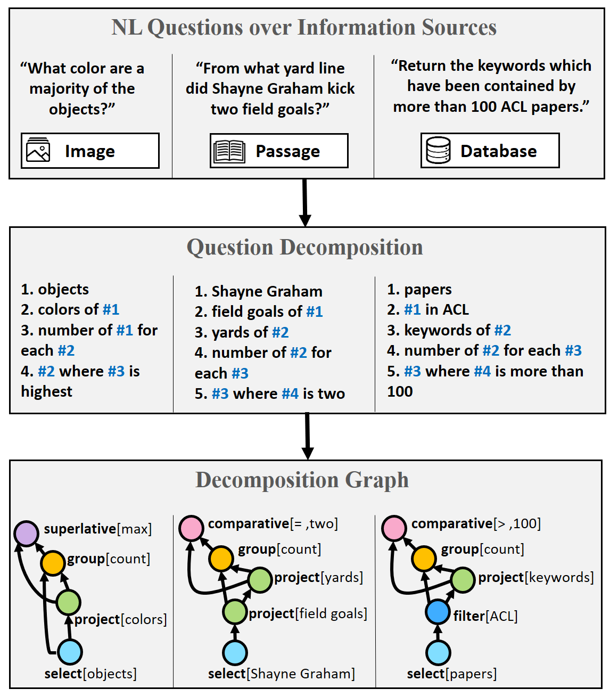
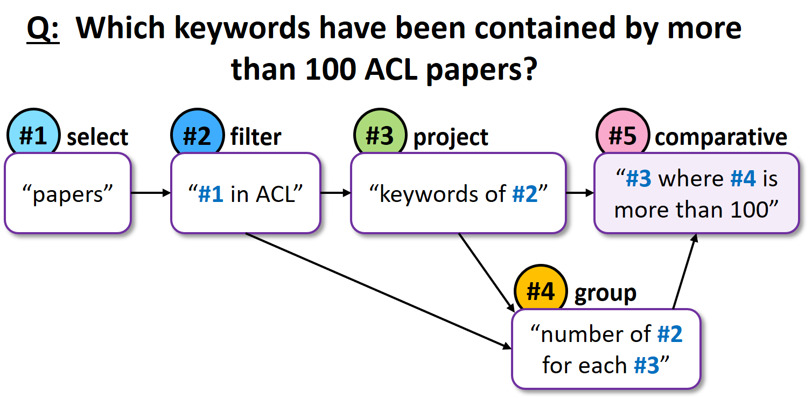
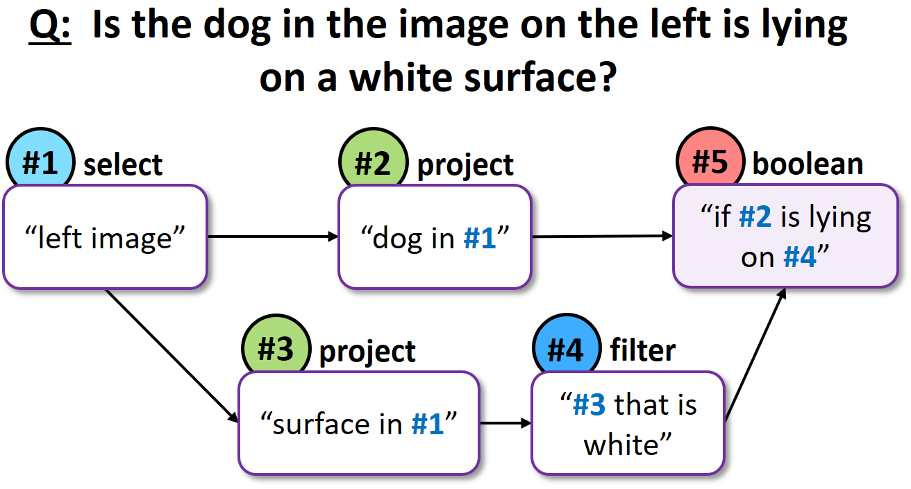
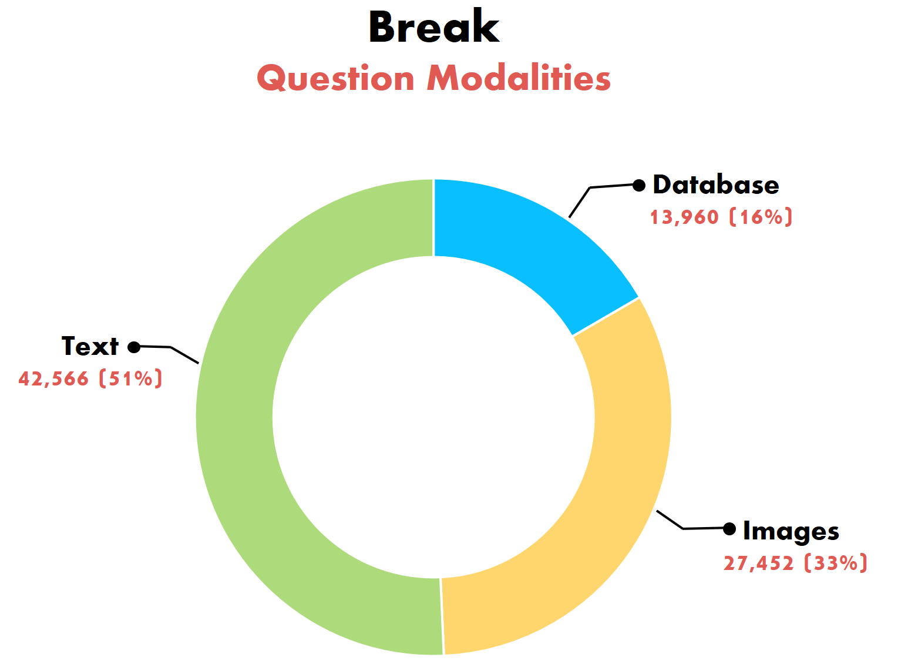
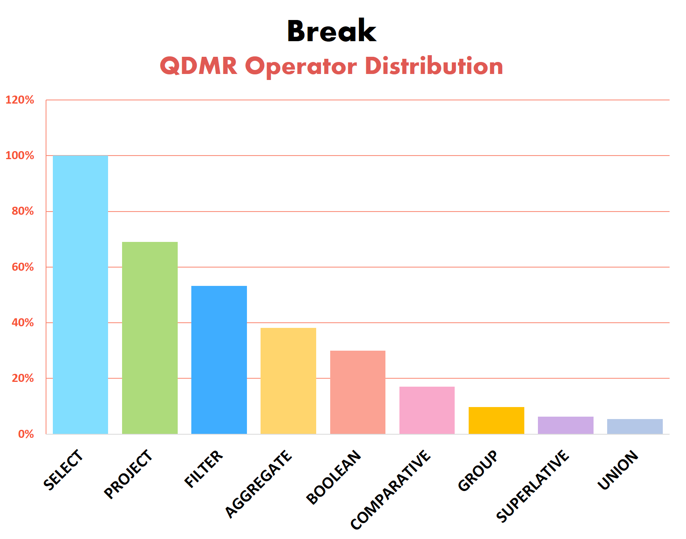

## **Break**: Mapping Natural Language Questions to their Meaning Representation

- *Check out [our blogpost](https://medium.com/ai2-blog/break-mapping-natural-language-questions-to-their-meaning-representation-31bb753701d6) at the official [AI2 blog!](https://medium.com/ai2-blog)*  

There has been a lot of work recently on answering complex natural language questions in multiple contexts. For example, the figure below shows three questions against a text paragraph, an image and a relational database (DB). While these questions represent separate QA tasks (*reading comprehension*, *visual question answering*, *semantic parsing*), they all require the same operations, such as fact chaining and counting. Current models often ignore the fact that questions share structure, regardless of their particular QA task. Thus, understanding the language of complex questions is being learned from scratch for each task!

This highlights the importance of **question understanding**, as a standalone language understanding task. To test whether a model *understands* a question, we focus on question decomposition. This ability, to compose and decompose questions, is a core part of human language [1] and allows us to tackle previously unseen problems. Training our models to decompose complex questions should bring us one step closer to solving tasks that require multi-step reasoning (where we do not have substantial amounts of data). 

    

### Representing the Meaning of Questions

Thinking how to represent the meaning of complex questions, we considered three key features:
- Capturing the ***sequence of computation steps*** for answering the question
- Capturing the meaning of a question, ***regardless of its context*** (text, image, DB)
- Expressing the formalism in ***natural language***, making it easy to annotate by non-experts

We introduce Question Decomposition Meaning Representation (QDMR), inspired by DB query languages and by semantic parsing.
In QDMR, complex questions are expressed through sub-questions (operators) that can be executed in sequence to answer the original question. Each QDMR operator either selects a set of entities, retrieves information about their attributes, or aggregates information over entities. Basically, we apply the intuition from DB query languages also to questions over images and text.
By abstracting away a question's context, QDMR allows in principle to query *multiple sources* for the same question. A system could potentially answer *“Name the political parties of the most densely populated country”*, by first returning *“the most densely populated country”* using a DB query, then *“the political parties of #1”* using a QA model for text.

Below are two examples of questions (over DB and images) with their respective QDMR representations. Note how the references to previous decomposition steps allow us to represent QDMR as a directed-acyclic-graph.  
For the full description of the QDMR formalism please refer to [our paper](https://allenai.github.io/Break/#paper).

    

      
      
    

### The Data

QDMR serves as the formalism for creating Break, a dataset aimed at probing question understanding models. It features 83,978 natural language questions, annotated with their Question Decomposition Meaning Representations. Break contains human composed questions, sampled from 10 leading question-answering benchmarks:

* **Semantic Parsing**: [Academic](https://github.com/jkkummerfeld/text2sql-data), [ATIS](https://github.com/jkkummerfeld/text2sql-data), [GeoQuery](https://github.com/jkkummerfeld/text2sql-data), [Spider](https://yale-lily.github.io/spider)
* **Visual Question Answering**: [CLEVR-humans](https://cs.stanford.edu/people/jcjohns/clevr/), [NLVR2](http://lil.nlp.cornell.edu/nlvr/)
* **Reading Comprehension (and KB-QA)**: [ComQA](http://qa.mpi-inf.mpg.de/comqa/), [ComplexWebQuestions](https://www.tau-nlp.org/compwebq), [DROP](https://allennlp.org/drop), [HotpotQA](https://hotpotqa.github.io/)  

Break was collected through crowdsourcing, with a user interface that allows us to train crowd workers to produce quality decompositions. Validating the quality of annotated structures reveals 97.4% to be correct. Our paper ["Break It Down: A Question Understanding Benchmark"](https://allenai.github.io/Break/#paper), accepted for publication in [TACL](https://transacl.org/index.php/tacl), has a full description of the data collection process. To see some more examples from the dataset, please check out [the Break website](https://allenai.github.io/Break/).   

We present some statistics of the question types and operators found in Break examples. Operator distribution, in particular, helps illustrate the reasoning types required by different QA tasks. For the full statistics of Break please refer to our [dataset repository](https://github.com/allenai/Break).

    

    

### The *"Break It Down!"* Challenge

Break is aimed at building systems that parse natural questions into their respective QDMR representations. We hope that this dataset, and its QDMR parsing challenge, will spur the development of future question understanding models. We encourage the NLP community to treat Break also as a resource for building better question answering systems.  

Our research has shown that multi-hop QA models, using Break decompositions, greatly outperform a strong BERT-based baseline, which does not. Additionally, we provide [neural QDMR parsing models](https://allenai.github.io/Break/#leaderboard), trained on Break, that beat a rule-based baseline that employs dependency parsing and coreference resolution.  
Visit the [Break website](https://allenai.github.io/Break/) to view the leaderboard and learn more.

[1] Francis Jeffry Pelletier. 1994. "The principle of semantic compositionality." *Topoi, 13(1):11–24*.
