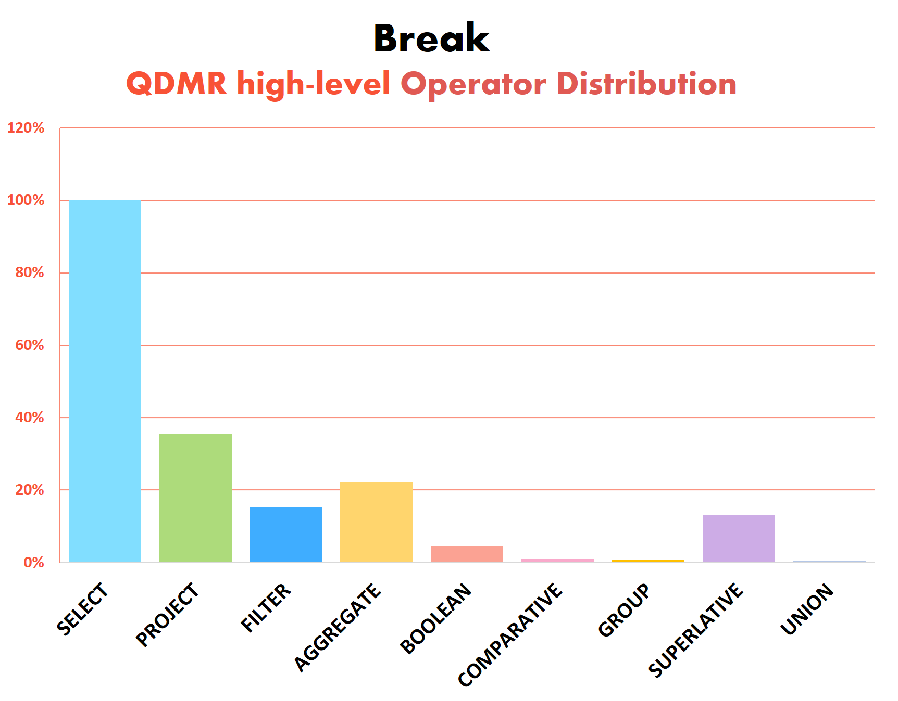

## Break: A New Dataset and Challenge for Question Understanding

- *Check out [our blogpost](https://medium.com/ai2-blog) at the official [AI2 blog!](https://medium.com/ai2-blog)*  

Increasing work has been devoted to models that can reason and integrate information from multiple parts of an input. This includes reasoning over images, paragraphs, documents, tables and more. **Question answering** (QA) is commonly used to probe models ability to reason. In QA tasks, a natural language question is posed and is to be answered given a particular context (text, image, KB). While questions often share structure regardless of their particular task (reading comprehension, visual question answering, semantic parsing), understanding the language of complex questions is being learned from scratch for each task! Note that all questions in the figure below require operations such as fact chaining and counting, regardless of their underlying modality.  

This highlights the importance of **question understanding**, as a standalone language understanding task. To test whether a model *understands* a question, we focus on question decomposition. The ability to compose and decompose questions is at the heart of human language [1] and allows us to tackle previously unseen problems. Teaching models to decompose complex questions, brings us one step closer to solving tasks that require multi-step reasoning, where we do not have access to substantial amounts of data. 

    

### Representing the Meaning of Questions

Thinking how to represent the meaning of complex questions, we considered two key features:
- Capturing the sequence of computation steps for answering the question
- Expressing the formalism in **natural language**, making it easy to annotate by non-experts at scale

We introduce a formalism for representing the meaning of questions that is agnostic to its underlying information source. Our formalism, Question Decomposition Meaning Representation (QDMR), is inspired by database query languages.  
We express complex questions through "atomic" sub-questions (operators) that can be executed in sequence to answer the original question. Each QDMR operator either selects a set of entities, retrieves information about their attributes, or aggregates information over entities. While this has been formalized in knowledge-base (KB) query languages, the same intuition can be applied to images and text. QDMR abstracts away the context, needed to answer the question, allowing in principle to query multiple sources for the same question.   

Below are examples of questions and their QDMR representations. Note that the references to previous decomposition steps enable us to represent QDMR as a directed-acyclic-graph.  
For the full description of the QDMR formalism please refer to [our paper](https://allenai.github.io/Break/#paper).

    

      
      
    

### The Data

QDMR serves as the formalism for creating Break, a dataset aimed at probing question understanding models. It features 83,978 natural language questions, annotated with their Question Decomposition Meaning Representations (QDMRs). Break contains human composed questions, sampled from 10 leading question-answering benchmarks:

* **Semantic Parsing**: [Academic](https://github.com/jkkummerfeld/text2sql-data), [ATIS](https://github.com/jkkummerfeld/text2sql-data), [GeoQuery](https://github.com/jkkummerfeld/text2sql-data), [Spider](https://yale-lily.github.io/spider)
* **Visual Question Answering**: [CLEVR-humans](https://cs.stanford.edu/people/jcjohns/clevr/), [NLVR2](http://lil.nlp.cornell.edu/nlvr/)
* **Reading Comprehension (and KB-QA)**: [ComQA](http://qa.mpi-inf.mpg.de/comqa/), [ComplexWebQuestions](https://www.tau-nlp.org/compwebq), [DROP](https://allennlp.org/drop), [HotpotQA](https://hotpotqa.github.io/)  

Break was collected through crowdsourcing, with a user interface that allows us to train crowd workers to produce quality decompositions. Validating the quality of annotated structures reveals 97.4% to be correct.  
Our paper ["Break It Down: A Question Understanding Benchmark"](https://allenai.github.io/Break/#paper), which has been accepted for publication in Transactions of the Association for Computational Linguistics, has a full description of the data collection process. To see some more examples from the dataset, please check out [the Break website](https://allenai.github.io/Break/). For the full statistics on Break please refer to the [dataset repository](https://github.com/allenai/Break).

    

    

      
      
    

### The *"Break It Down!"* Challenge

Break is aimed at building systems that parse natural questions into their respective QDMR representations. We hope that this dataset, and its QDMR parsing challenge, will spur the development of future question understanding models. We further encourage the NLP community to also treat Break as a resource for building better question answering systems.  

Our research has shown that multi-hop QA models using Break decompositions greatly outperform a strong BERT-based baseline which does not. Additionally, we provide [neural QDMR parsing models](https://allenai.github.io/Break/#leaderboard), trained on Break, that beat a rule-based baseline that employs dependency parsing and coreference resolution.  
Visit the [Break website](https://allenai.github.io/Break/) to view the leaderboard and learn more.

[1] Francis Jeffry Pelletier. 1994. "The principle of semantic compositionality." *Topoi, 13(1):11–24*.
