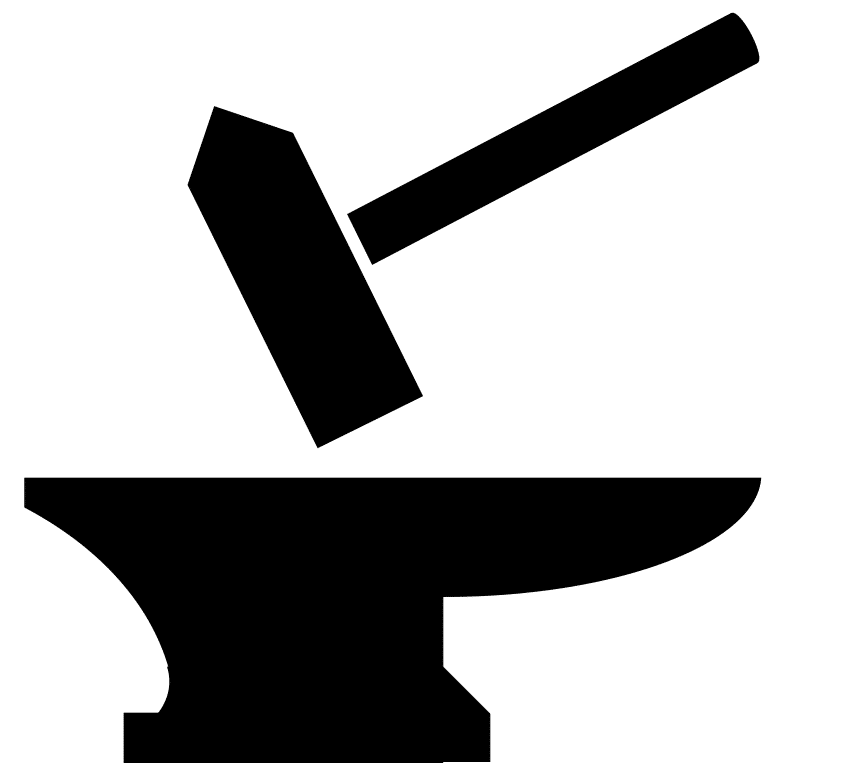
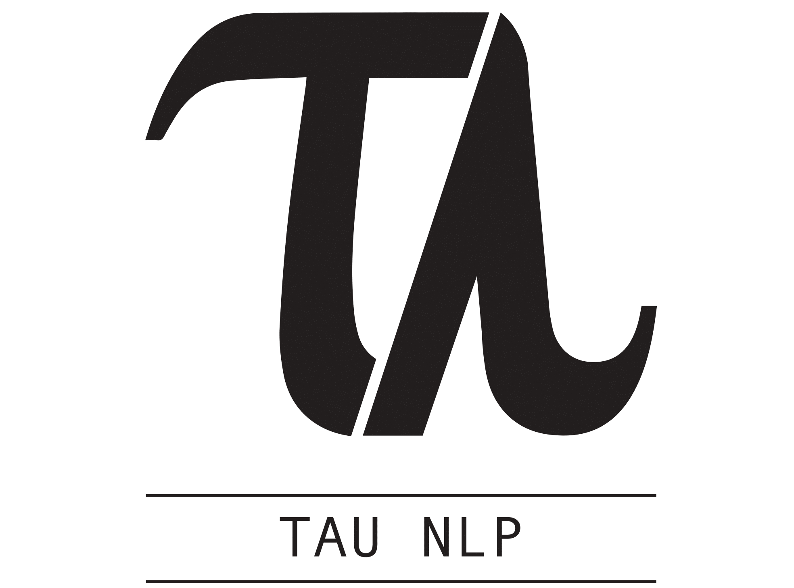
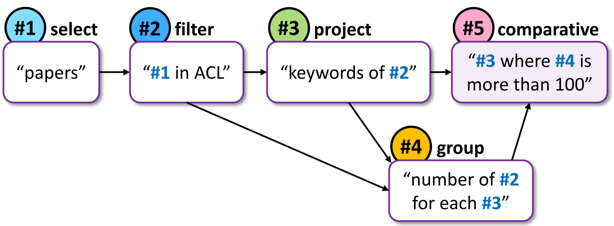

<p float="left">
  
  <a href="https://allenai.org/">
    
  </a>
  <a href="https://www.tau-nlp.org/">
    
  </a>
</p>

## **A Question Understanding Benchmark**

Released February 2020.  
[Link to blogpost](/blogpost.md).

- Merit number one
- Merit number two

<div>
  <p class="note">
     <i>"Some question"</i>
  </p>
</div>
<div>
  <p class="note">
    <i>"A totally different and complex question"</i>
  </p>
</div>
<div>
  <p class="note">
      <i>"A totally other question"</i>
  </p>
</div>

Contains questions over modality 1 from <a href="somelink">**Dataset1**</a>, <a href="somelink">**Dataset1**</a>, <a href="somelink">**Dataset1**</a> and <a href="somelink">**Dataset1**</a>.  
Contains questions over modality 2 from <a href="somelink">**Dataset1**</a>, <a href="somelink">**Dataset1**</a>, <a href="somelink">**Dataset1**</a> and <a href="somelink">**Dataset1**</a>.  
Contains questions over modality 3 from <a href="somelink">**Dataset1**</a>, <a href="somelink">**Dataset1**</a>, <a href="somelink">**Dataset1**</a> and <a href="somelink">**Dataset1**</a>.  




## **Paper**


<a href="https://arxiv.org/">
  **Paper Name**  
</a>
*Authors List*  
Publication Venue 2020  

```markdown
@inproceedings{some2020paper,
  title={Paper Title},
  author={FirstName1, LastName1 and FirstName2, LastName2 and FirstName3, LastName3 and FirstName4, LastName4 and FirstName5, LastName5 and FirstName6, LastName6 and FirstName7, LastName7},
  booktitle={The Journal},
  year={2020}
}
```

## **Authors**

> Talent wins games, but teamwork and intelligence wins championships.

*Michael Jordan*

<div>
<div class="card">
  
  <div class="container">
    <h4><b>John Doe</b></h4>  
  </div>
</div>
<div class="card">
  
  <div class="container">
    <h4><b>John Doe</b></h4> 
  </div>
</div>
<div class="card">
  
  <div class="container">
    <h4><b>John Doe</b></h4> 
  </div>
</div>
<div class="card">
  
  <div class="container">
    <h4><b>John Doe</b></h4> 
  </div>
</div>
<div class="card">
  
  <div class="container">
    <h4><b>John Doe</b></h4> 
  </div>
</div>
<div class="card">
  
  <div class="container">
    <h4><b>John Doe</b></h4> 
  </div>
</div>
<div class="card">
  
  <div class="container">
    <h4><b>John Doe</b></h4> 
  </div>
</div>
</div>


## **Leaderboard**

### **Submission**
Official Leaderboard submission.

### **Results**

Rank | Submission | Created | EM Dev. | EM Test
------------ | ------------- | ------------- | ------------- | -------------
1 | First Model | First Model | `00.00`  | `00.00`
2 | Second Model | Second Model | `00.00`  | `00.00` 


## **Explore**
[Link to blogpost](/explore.md).

## **Download**
Click here
